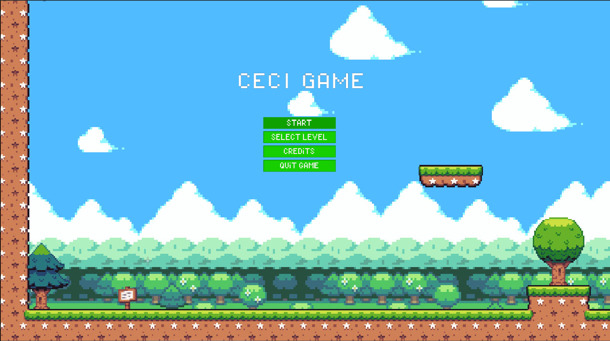
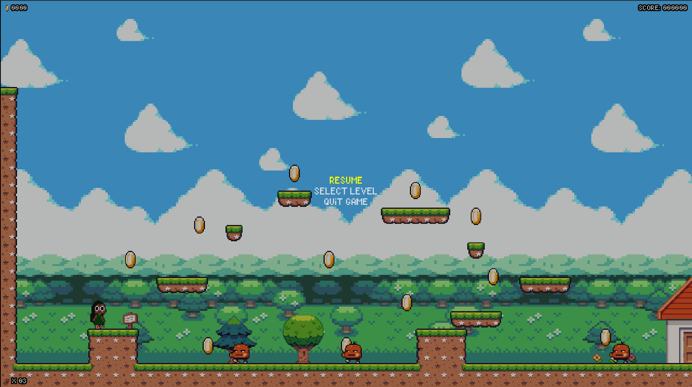
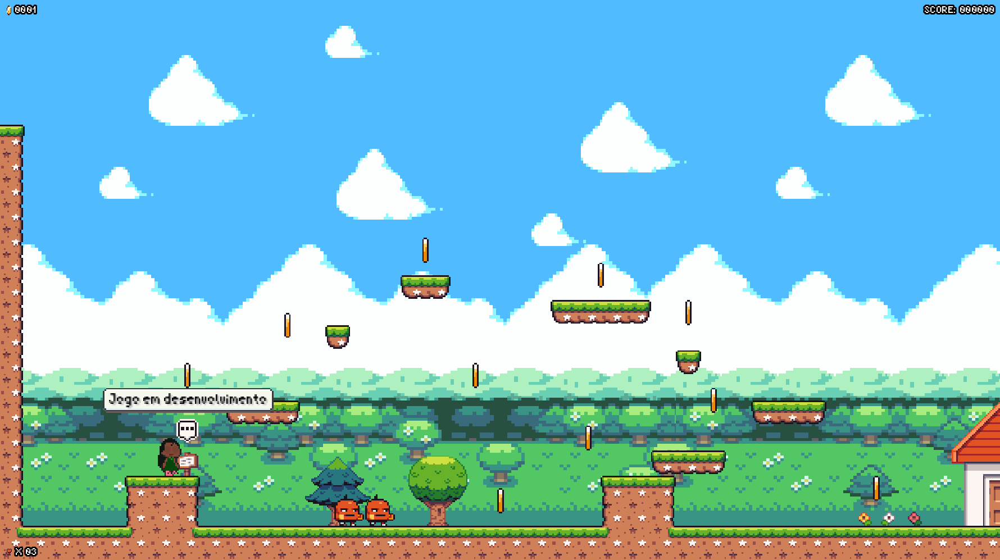

# 👽 Ceci's Game: Echoes of a Dying Planet

> *Projeto desenvolvido para a Liga de Jogos da UEFS (IEEE).*


*(Substitua este link acima por uma imagem de capa do seu jogo)*

## 📖 Sobre o Jogo
**"E se uma nave alienígena pousasse no seu quintal pedindo socorro?"**

Ceci's Game transporta o jogador para um planeta alienígena futurista que enfrenta um colapso ambiental catastrófico. O que antes era um paraíso tecnológico, agora clama por ajuda. Assuma o papel do protagonista que decide não ignorar esse chamado e embarque em uma jornada para restaurar o equilíbrio de um ecossistema em ruínas.

### 🌟 Destaques
* **Narrativa Ambiental:** Uma crítica lúdica sobre preservação e consequências tecnológicas.
* **Exploração:** Descubra cenários futuristas decadentes.
* **Engine:** Desenvolvido 100% na **Godot Engine**.

---

## 📸 Galeria
| Menu Principal | Gameplay |
|:---:|:---:|
|  |  |
*(Coloque os links dos seus prints aqui)*

---

## 🎮 Como Jogar

### Pré-requisitos
* [Godot Engine 4.x](https://godotengine.org/) instalado.

### Passo a Passo
1.  Clone este repositório:
    ```bash
    git clone [https://github.com/Yarlley31/Ceci-s-Game.git](https://github.com/Yarlley31/Ceci-s-Game.git)
    ```
2.  Abra a **Godot Engine**.
3.  Clique em **Import** e selecione o arquivo `project.godot` dentro da pasta clonada.
4.  Pressione **F5** para rodar o jogo!

---

## 🛠 Tecnologias
* **Engine:** Godot 4
* **Linguagem:** GDScript
* **Design/Assets:** (Se você usou assets prontos ou fez, cite aqui. Ex: Kenney Assets, Itch.io ou "Arte Original")

---

## 👥 Equipe
<table>
  <tr>
    <td align="center">
      <a href="https://github.com/Yarlley31">
        <br>
        <sub><b>Yarlley Fernandes</b></sub>
      </a>
    </td>
    </tr>
</table>

---

### 🏆 Contexto
Este jogo foi criado como participação na **Liga de Desenvolvimento de Jogos da UEFS**.
*Status atual: Em desenvolvimento ativo.*
